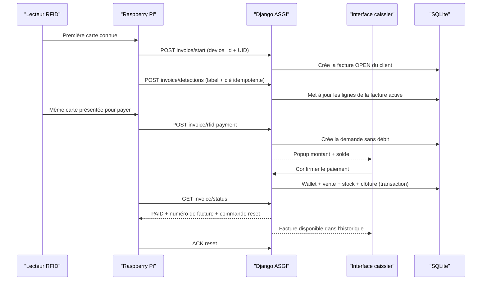
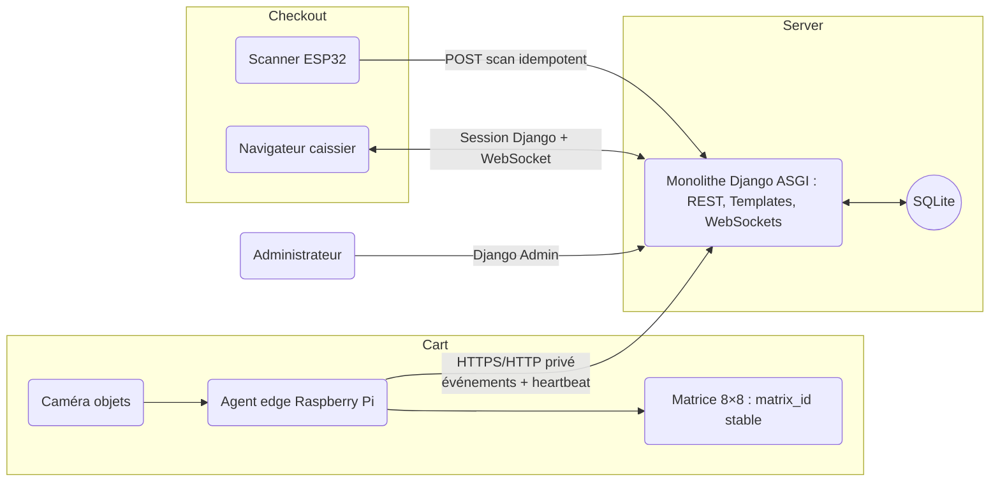

# Architecture cible — Kitunga AI

<!-- architecture-section: executive-verdict -->
## Executive Verdict

- **Recommendation :** conserver un monolithe Django ASGI, une base SQLite et Django Channels, structuré autour des Raspberry Pi, factures actives, détections, clients RFID, wallets et ventes. La Pi s'identifie par son `device_id` sur le LAN privé et ne manipule aucun identifiant interne de panier.
- **Pourquoi cette solution convient :** elle prolonge la stack déjà opérationnelle, reste exploitable par une petite équipe, évite les microservices et donne un propriétaire unique aux prix, paniers, ventes et stocks.
- **Risque principal :** une caméra qui envoie la même classe à chaque image crée des doublons. La Raspberry Pi doit transformer les observations vidéo en événements stables `ITEM_ADDED`/`ITEM_REMOVED`, persistés et idempotents, et la caisse doit toujours permettre une correction humaine.
- **Décision retenue :** la première carte RFID connue ouvre une facture ; une seconde lecture crée une demande que le caissier confirme côté backend avant tout débit. Le paiement manuel reste possible et toute facture terminée est historisée.
- **Peut attendre :** PostgreSQL, Redis, MQTT, cloud, paiement électronique et fonctionnement multi-magasin.
- **Confiance :** élevée pour la structure générale ; moyenne pour la logique de comptage visuel tant qu'elle n'a pas été testée avec de vrais ajouts/retraits d'objets en magasin.

<!-- architecture-section: project-frame -->
## Cadre du projet

### Objectifs

- Associer une Raspberry Pi et une caméra à chaque poste de détection.
- Reconnaître les objets électroniques déposés ou retirés, puis afficher le contenu et les prix en temps réel.
- Identifier le client par RFID et ouvrir automatiquement une nouvelle facture sur la Pi.
- Permettre le paiement RFID contrôlé par le backend ou une confirmation manuelle par le caissier.
- Décrémenter le stock et conserver un historique de vente seulement après confirmation.
- Réinitialiser proprement la Raspberry Pi et ouvrir un nouveau cycle à la prochaine carte après la vente.
- Gérer les produits, prix, labels IA, stocks, paniers et équipements depuis Django.

### Hors périmètre initial

- Paiement bancaire ou mobile automatisé ; la première version enregistre une vente et son mode/statut de paiement.
- Fonctionnement sans serveur à la caisse.
- Multi-magasin, cloud, haute disponibilité et synchronisation inter-sites.
- Analyse vidéo ou entraînement du modèle IA dans Django.
- Paiement bancaire ou mobile externe.

### Contraintes

- Django 6.0.7, DRF, Channels et Daphne sont déjà installés.
- SQLite est demandé et convient à une première version locale à faible concurrence.
- Le format de matrice existant utilise 12 bits, soit 4096 motifs possibles.
- Le serveur, les Raspberry Pi et le scanner sont supposés partager un réseau local de magasin.
- Le réseau local est considéré comme la frontière de confiance pour les Raspberry Pi : leur `device_id` doit exister et être activé, sans secret ni appairage.
- La caisse doit rester contrôlée par un utilisateur authentifié ; un scan matériel n'est pas une autorisation de vente.

<!-- architecture-section: evidence-and-assumptions -->
## Preuves, hypothèses et inconnues

| Élément | Type | Confiance | Impact si faux | Validation |
|---|---|---:|---|---|
| Le backend actuel est un monolithe Django/DRF/Channels avec SQLite. | Fait vérifié | Haute | Faible | `core/settings.py`, `api/*`, `requirements.txt` |
| Les endpoints Raspberry actuels ajoutent directement une quantité à partir d'un label. | Fait vérifié | Haute | Élevé : doublons et incohérences | `api/views.py` |
| L'API Pi valide le `device_id`, sans secret, conformément au choix d'exploitation sur LAN privé. | Décision validée | Haute | Élevé si le réseau cesse d'être maîtrisé | `apps/devices/authentication.py` |
| Le format 8×8 encode tous les identifiants `0..4095`, avec trois copies masquées et vote majoritaire. | Fait exécuté | Haute | Élevé si le décodage matériel diffère | 4 tests matrice réussis |
| Le scanner ESP32 exige trois lectures stables et transmet déjà `event_id`, qualité et identifiant. | Fait vérifié | Haute | Faible | Firmware ESP32 |
| Le scanner ESP32 envoie actuellement vers un petit récepteur SQLite hébergé sur une Raspberry Pi. | Fait vérifié | Haute | Élevé pour la topologie cible | Prototype `communication_raspberry_pi` |
| La première livraison concerne un magasin, un serveur local, une petite flotte de paniers et une ou deux caisses. | Hypothèse | Moyenne | Peut imposer PostgreSQL/Redis plus tôt | Mesurer nombre de paniers, terminaux et événements/s |
| La Raspberry Pi peut déterminer un ajout et un retrait stables, pas seulement répéter une classification à chaque image. | Hypothèse critique | Faible à moyenne | Quantités non fiables | Prototype réel avec tracking et scénarios ajout/retrait |
| Le scanner de caisse peut rejoindre le même LAN que Django. | Hypothèse | Moyenne | Nécessite une passerelle de caisse | Test réseau sur site |
| Aucun traitement réglementé ou donnée client n'est requis pour la V1. | Hypothèse | Moyenne | Étend les contrôles de sécurité et rétention | Validation métier |
| Le mode de paiement final n'est pas encore choisi. | Inconnu | — | N'empêche pas l'architecture panier/vente | Décision produit ultérieure |

<!-- architecture-section: critical-flows -->
## Flux critiques

1. **Provisionnement :** un administrateur crée `BasketDevice` avec un `device_id` et, si nécessaire, un `matrix_id`. Aucun secret Pi ou appairage n'est généré.
2. **Identification :** la première lecture d'une carte RFID connue crée une `BasketSession` `OPEN` pour le client. Une seule facture peut être active par Pi ; le heartbeat et les détections ne la créent jamais.
3. **Détection :** la Pi stabilise les observations, crée un événement idempotent et l'envoie sans `basket_id`. Django retrouve la facture active par `device_id`, résout le produit et met à jour ses lignes.
4. **Paiement RFID :** une seconde lecture crée une `RfidPaymentRequest` et notifie la caisse sans débiter. La confirmation authentifiée verrouille la demande, la facture, le wallet et le stock, puis débite, crée `Sale` et `SaleLine`, décrémente le stock et clôture dans une transaction unique.
5. **Paiement manuel :** un caissier peut relire et corriger la facture, puis confirmer qu'elle est payée. Le même service transactionnel crée la vente et les mouvements de stock.
6. **Historique :** chaque cycle terminé reste accessible comme facture avec le client, les lignes figées, le paiement, l'appareil et l'opérateur.
7. **Réinitialisation :** la Pi reçoit `RESET_SESSION`, efface son tracking, acquitte la commande, puis attend la prochaine carte RFID pour ouvrir un nouveau cycle.
8. **Panne réseau :** la Pi conserve les opérations non acquittées et réutilise leurs clés d'idempotence. Une réponse perdue ne peut ni doubler une ligne, ni débiter deux fois, ni décrémenter deux fois le stock.

### Séquence de facturation RFID



<!-- architecture-section: quality-scenarios -->
## Scénarios de qualité

| ID | Contexte et stimulus | Réponse mesurable | Statut | Preuve attendue |
|---|---|---|---|---|
| NFR-001 | Un événement Pi ou un scan est envoyé plusieurs fois. | La quantité, le statut et le stock ne changent qu'une fois ; les répétitions retournent le même résultat. | Proposé | Tests de contrat avec la même clé d'idempotence |
| NFR-002 | Le caissier clique deux fois ou la réponse de finalisation est perdue. | Une seule vente est créée et le stock est décrémenté une seule fois. | Proposé | Test transactionnel et contrainte unique |
| NFR-003 | Une détection valide est reçue sur le LAN. | L'interface active reflète l'état en moins de 1 seconde au p95 dans la charge pilote. | Cible provisoire | Mesure horodatée Pi → API → WebSocket → navigateur |
| NFR-004 | Le réseau Pi est indisponible pendant 30 minutes. | Aucun événement acquitté n'est rejoué ; les événements non acquittés survivent au redémarrage et sont renvoyés dans l'ordre. | Proposé | Test de coupure avec file SQLite edge |
| NFR-005 | Un scan 8×8 est bruité ou répété. | Il faut au moins trois lectures stables ; les seuils actuels de cadre/copies restent respectés ; aucun scan seul ne facture. | Partiellement prouvé | Tests codec réussis + campagne matérielle de faux positifs |
| NFR-006 | Un appareil désactivé ou un utilisateur non autorisé appelle une mutation. | 100 % des appels sont refusés et aucune donnée n'est modifiée. | Proposé | Tests 401/403 et tests de rôles |
| NFR-007 | Django ou le PC redémarre. | Les paniers, événements, ventes et commandes persistent ; l'UI recharge l'état par HTTP après reconnexion. | Proposé | Test de redémarrage contrôlé |
| NFR-008 | Le fichier SQLite est perdu ou corrompu. | Cible initiale RPO ≤ 15 min et RTO ≤ 1 h. | Cible provisoire | Sauvegarde/restore chronométré sur une copie représentative |
| NFR-009 | Deux écritures concurrentes ciblent le même panier. | Une seule version gagne ; l'autre reçoit `409 version_conflict` et recharge. | Proposé | Test concurrent avec `expected_version` |

<!-- architecture-section: architecture -->
## Architecture

### Contexte et frontières



Le scanner n'appelle jamais la Raspberry du panier. La matrice est un identifiant visuel public, pas un secret et pas une preuve de paiement. Toute décision métier est prise dans Django.

### Structure cible de la base de code

```text
backend/
├── core/                   # settings, urls, ASGI, sécurité et configuration
├── apps/
│   ├── catalog/            # Product, VisionLabel, écrans catalogue
│   ├── devices/            # BasketDevice, CheckoutTerminal, heartbeat, commandes
│   ├── baskets/            # BasketSession, BasketLine, DetectionEvent
│   ├── checkout/           # MatrixScanEvent, Sale, SaleLine, StockMovement
│   └── dashboard/          # vues de caisse, supervision et projections de lecture
├── templates/              # pages Django, sans IP codée en dur
├── static/                 # CSS/JS locaux
├── tests/                  # contrats appareils, transactions et parcours caisse
└── docs/                   # architecture, contrats et procédures
```

Chaque app peut utiliser `services.py` pour les transactions métier et `selectors.py` pour les lectures. Les serializers DRF valident les contrats HTTP ; ils ne portent pas la logique de facturation. L'app `api` actuelle reste temporairement comme adaptateur de compatibilité, puis disparaît après migration.

### Composants et propriété

| Composant | Responsabilité principale | Données/ressources possédées | Entrées/sorties | Dépendances autorisées | Comportement en panne |
|---|---|---|---|---|---|
| Agent edge Raspberry | Stabiliser/tracker les objets, lire la RFID, produire des événements et bufferiser hors ligne | SQLite edge et `device_id` | RFID/caméra → API facture ; statut/commandes | Caméra, lecteur RFID, Django API | Continue à observer et met en file ; n'invente jamais un ACK |
| Matrice MAX7219 | Afficher le `matrix_id` stable du panier physique | Aucun état métier | 12 bits visuels | Pi ou microcontrôleur local | L'échec n'altère pas le panier serveur ; caisse peut saisir le numéro manuellement |
| Scanner ESP32 | Lire/stabiliser le motif et transmettre un scan de caisse | Petite file de scans, identité du terminal | Matrice → `MatrixScanEvent` REST | LAN, Django API | Affiche échec et réessaie ; ne confirme pas une vente |
| `catalog` | Catalogue, prix, stock courant et labels IA | `Product`, `VisionLabel` | Admin et résolution de label | ORM Django | Label inconnu → objet non répertorié/revue humaine |
| `devices` | Identités matérielles, présence et commandes | `BasketDevice`, `CheckoutTerminal`, `DeviceCommand` | Validation `device_id` Pi, auth terminal, heartbeat, ACK | ORM, configuration | Appareil inconnu/désactivé refusé |
| `baskets` | Cycle d'un panier et application idempotente des événements | `BasketSession`, `BasketLine`, `DetectionEvent` | API Pi, lectures UI, notifications | `catalog`, `devices`, Channels | Événement douteux conservé sans modifier les lignes |
| `checkout` | Scan, verrouillage, correction, vente et stock | `MatrixScanEvent`, `Sale`, `SaleLine`, `StockMovement` | API scanner et actions caissier | `baskets`, `catalog`, `devices` | Transaction annulée intégralement en cas d'erreur |
| `dashboard` | Interface caissier et supervision | Aucune source de vérité | Templates/HTTP/WebSocket | Selectors des apps métier | Recharge l'état HTTP après perte WebSocket |
| SQLite central | Source de vérité transactionnelle locale | Toutes les données Django | ORM | Un processus Django d'écriture | Les écritures peuvent se sérialiser ; sauvegarde et restore requis |
| Channels mémoire | Notification temps réel, jamais persistance | Messages éphémères | `basket.updated`, `checkout.selected` | Un seul processus ASGI | Message perdu → le navigateur recharge par HTTP |

<!-- architecture-section: data-and-contracts -->
## Données et contrats

### Source de vérité

Django/SQLite est l'unique source de vérité des paniers, prix appliqués, ventes et stocks. La Pi possède seulement un journal edge non acquitté et un état de vision reconstruisible. Le navigateur et le scanner ne calculent jamais le total autoritatif.

### Modèle de données cible

| Entité | Champs structurants | Contraintes/invariants |
|---|---|---|
| `Product` | `sku`, `name`, `current_price`, `stock_quantity`, `is_active` | Argent en `Decimal`, SKU unique, stock non négatif sauf override audité ; aucun code-barres |
| `VisionLabel` | `label`, `product_id`, `model_version`, `is_active` | Résolution explicite ; ne plus deviner via le nom du produit |
| `BasketDevice` | `device_code`, `matrix_id`, `enabled`, `last_seen_at`, `reset_state` | `device_code` unique ; `matrix_id` unique entre `1` et `4095`; aucun secret Pi |
| `BasketSession` | UUID, `device_id`, `status`, `version`, dates | Une seule session `OPEN` ou `CHECKOUT_PENDING` par équipement |
| `BasketLine` | `session_id`, `product_id`, `quantity`, `unit_price_snapshot` | Unique `(session, product)` ; quantité strictement positive |
| `DetectionEvent` | `device_id`, `session_id`, `event_id`, `boot_id`, `sequence`, action, label, confiance, dates, résultat | Unique `(device, event_id)` ; payload borné ; événement toujours auditable |
| `CheckoutTerminal` | `terminal_code`, `credential_hash`, `enabled`, `last_seen_at` | Secret individuel et révocable |
| `MatrixScanEvent` | `terminal_id`, `event_id`, `matrix_id`, métriques qualité, `session_id`, résultat | Unique `(terminal, event_id)` ; un doublon ne retrigger pas le workflow |
| `Sale` | UUID/numéro, `session_id`, caissier, totaux, paiement, dates, `idempotency_key` | Une vente au plus par session ; clé de finalisation unique |
| `SaleLine` | `sale_id`, produit, nom/SKU/prix/quantité figés | Snapshot historique indépendant des futures modifications produit |
| `StockMovement` | produit, type, quantité signée, vente, auteur, date | Toute variation de stock possède une cause et un auteur |
| `DeviceCommand` | appareil, type, session, statut, dates | `RESET_SESSION` reste visible jusqu'à ACK ou action manuelle |

Le `matrix_id` identifie le **panier physique**, alors que l'UUID `BasketSession.id` identifie un **cycle d'achat**. Ne jamais réutiliser la clé primaire Django ou un numéro de vente comme motif 8×8.

### États de session

```text
OPEN ──scan caisse──> CHECKOUT_PENDING ──confirmation──> COMPLETED
  │                         │
  └────annulation────> CANCELLED <──libération/refus────┘
                            
CHECKOUT_PENDING ──correction nécessaire──> OPEN
```

- Seul `OPEN` accepte des événements d'ajout/retrait.
- `CHECKOUT_PENDING` fige les lignes ; les événements tardifs sont journalisés et retournent `409 basket_locked`.
- `COMPLETED` est terminal. Après ACK du reset, la prochaine carte RFID crée une nouvelle session.
- `CANCELLED` ne produit ni vente ni mouvement de stock.

### Transactions et cohérence

1. **Ingestion :** `transaction.atomic()` crée `DetectionEvent` avec une contrainte unique, vérifie la version/statut, puis applique le delta à `BasketLine`. Une répétition retourne l'ancien résultat.
2. **Sélection caisse :** création/déduplication du scan et transition conditionnelle `OPEN → CHECKOUT_PENDING` avec incrément de `version`.
3. **Finalisation :** transition conditionnelle sur `expected_version`, création de `Sale/SaleLine`, mouvements et décrément du stock, session `COMPLETED`, commande `RESET_SESSION`, le tout dans une transaction.
4. **Concurrence SQLite :** utiliser des mises à jour conditionnelles (`WHERE version=? AND status=?`) et vérifier le nombre de lignes touchées. Ne pas supposer un verrouillage par ligne ; SQLite sérialise les écritures.
5. **Prix :** `BasketLine.unit_price_snapshot` est fixé lors du premier ajout. Une modification du catalogue n'altère pas un panier déjà ouvert. `SaleLine` fige à nouveau les valeurs facturées.

### API appareil Raspberry — REST JSON

| Méthode et chemin | Usage | Idempotence/réponse |
|---|---|---|
| `POST /api/iot/devices/{device_id}/invoice/start/` | Première lecture RFID, identification client et ouverture de facture | Reprend la facture du même client ; n'expose aucun identifiant interne |
| `POST /api/iot/devices/{device_id}/invoice/detections/` | Ajout confirmé par la vision sur la facture active | `Idempotency-Key = event_id`; aucun `basket_id` dans la requête |
| `GET /api/iot/devices/{device_id}/invoice/status/` | État `IDLE`, `ACTIVE`, `CHECKOUT_PENDING` ou `PAID` | Répétable ; permet de récupérer une confirmation perdue |
| `POST /api/iot/devices/{device_id}/invoice/rfid-payment/` | Vérification et paiement backend par la même carte | Idempotent ; wallet, vente et stock dans une transaction |
| `POST /api/v1/devices/{device_id}/heartbeat` | Présence, version logicielle et récupération de commande | Répétable ; ne crée jamais de facture |
| `POST /api/v1/devices/{device_code}/commands/{command_id}/ack` | Confirmer le reset effectué | Répétable |
| `GET /api/v1/devices/{device_code}/state` | Diagnostic/provisionnement | État minimal |

Exemple d'événement :

```json
{
  "label": "arduino_mega_2560",
  "confidence": 0.96
}
```

Réponses stables : `201 applied`, `401 DEVICE_UNAUTHORIZED`, `409 NO_ACTIVE_INVOICE`, `409 basket_locked`, `422 invalid_event`.

### API scanner et caisse

| Méthode et chemin | Acteur | Usage |
|---|---|---|
| `POST /api/v1/checkout/scans` | Scanner authentifié | Enregistre `event_id`, `matrix_id`, métriques de qualité et sélectionne une session |
| `GET /api/v1/cashier/sessions/{uuid}` | Caissier | Charge l'état autoritatif et sa `version` |
| `PATCH /api/v1/cashier/sessions/{uuid}/lines/{line_id}` | Caissier | Corrige quantité/produit avec `expected_version` et motif |
| `POST /api/v1/cashier/sessions/{uuid}/complete` | Caissier | Finalise avec `Idempotency-Key` et `expected_version` |
| `POST /api/v1/cashier/sessions/{uuid}/release` | Caissier | Retourne le panier à `OPEN` sans facturer |
| `POST /api/v1/cashier/sessions/{uuid}/cancel` | Responsable | Annule avec motif audité |

Le scanner transmet ses métriques existantes (`frame_errors`, `copy_disagreements`, `cell_contrast`) mais Django se contente de les auditer et d'appliquer un seuil configuré. Il ne reçoit ni le contenu du panier ni les prix.

### Contrats WebSocket

- `/ws/v1/cashier/terminals/{terminal_code}/` : `checkout.basket_selected`, `basket.updated`, `sale.completed`, `device.offline`.
- `/ws/v1/baskets/{matrix_id}/` : lecture du panier pour un éventuel écran client.
- Les messages portent des identifiants et une `version`, pas des objets métier arbitraires. À la connexion/reconnexion, le client recharge toujours l'état complet par HTTP.
- Le navigateur construit l'URL depuis `window.location.host`; aucune IP ne doit être codée en dur.

### Compatibilité et migration

- Créer `/api/v1` sans casser immédiatement les routes actuelles `/api/baskets/...`.
- Adapter temporairement l'ancien payload en un événement v1 marqué `legacy`.
- Observer les appels aux anciennes routes ; les retirer seulement après zéro usage pendant la fenêtre convenue.
- Ne plus modifier `0001_initial.py`, déjà appliquée. Toute évolution passe par de nouvelles migrations `0002+` avec sauvegarde préalable.

<!-- architecture-section: trust-and-security -->
## Confiance et sécurité

- **Utilisateurs :** authentification Django par session. Groupes `Administrateur`, `Caissier`, `Superviseur`; la correction, l'annulation et le forçage de stock ont des permissions distinctes.
- **Appareils :** la Pi est reconnue par un `device_id` enregistré et activé sur le LAN sécurisé. Seul le `CheckoutTerminal` optionnel conserve un secret individuel haché côté serveur.
- **Réseau initial :** LAN privé unique avec SSID du magasin. Ne pas créer un hotspot identique sur chaque panier. Le serveur reçoit une réservation DHCP ou le nom `kitunga.local`.
- **Transport :** HTTP peut être toléré uniquement pendant le pilote sur un LAN isolé et non exposé. Avant un réseau partagé/public, placer Django derrière TLS et faire confiance au certificat sur Pi/ESP32.
- **WebSockets :** vérifier l'utilisateur, le rôle et le terminal avant `accept()` ; ne plus accepter toute connexion par simple connaissance du `device_id`.
- **Entrées non fiables :** bornes de taille, schéma strict, labels autorisés, `matrix_id 1..4095`, confiance `0..1`, quantité bornée et limitation de débit par appareil.
- **Rejeu :** clé d'idempotence unique, timestamps serveur et événement associé au `device_id`. Le numéro matriciel étant public, il ne confère aucun droit.
- **Secrets/configuration :** `SECRET_KEY`, `DEBUG`, hôtes, origines et secrets des terminaux viennent de variables d'environnement ; aucun secret dans Git ou les logs.
- **Données :** catalogue, paniers, ventes et métriques techniques sont internes. Les journaux n'incluent ni clé, ni image caméra, ni payload complet par défaut.
- **Audit :** conserver détections, scans, corrections, transitions, ventes et mouvements de stock avec auteur/appareil et horodatage UTC.

<!-- architecture-section: deployment-and-operations -->
## Déploiement et exploitation

- **Topologie initiale :** un PC/mini-PC local, un processus Daphne, SQLite sur disque local, pages Django same-origin et Channels en mémoire. Les appareils utilisent le même point d'accès réseau.
- **Démarrage :** service système Windows/Linux, pas un terminal manuel en production. Un seul processus ASGI tant que le channel layer reste en mémoire.
- **SQLite :** activer WAL, un `busy_timeout`, transactions courtes et indexes sur états, équipements, idempotency keys et dates. Ne jamais copier naïvement un fichier SQLite ouvert ; utiliser l'API backup SQLite ou un arrêt cohérent.
- **Sauvegardes :** copie cohérente toutes les 15 minutes, sauvegarde quotidienne conservée séparément, test de restauration mensuel. Ce sont des cibles initiales à confirmer avec le métier.
- **Santé :** `/health/live` vérifie le processus ; `/health/ready` vérifie l'accès SQLite et les migrations. Aucun détail sensible dans la réponse publique.
- **Logs structurés :** `request_id`, `device_code`, `event_id`, `session_id`, `terminal_code`, statut et durée. Ne pas imprimer le JSON complet reçu de la Pi.
- **Supervision métier :** dernière présence appareil, événements refusés/inconnus, trous de séquence, scans échoués, paniers bloqués, commandes reset non acquittées, erreurs SQLite et sauvegarde la plus récente.
- **Dégradation :** une panne WebSocket n'empêche pas l'API ; l'UI repasse au polling/rechargement. Une panne serveur bloque la facturation mais la Pi met ses événements en file. Une panne matrice permet une saisie manuelle contrôlée du numéro.
- **Rollout :** sauvegarde, migrations expand, déploiement serveur compatible, pilote avec un panier et une caisse, mise à jour Pi/scanner, puis extension. Rollback applicatif seulement vers une version compatible avec le schéma étendu.

### Seuils d'évolution

- Passer à Redis pour Channels uniquement lors d'un second processus ASGI ou si la perte de notifications devient opérationnellement inacceptable.
- Passer à PostgreSQL lorsque des erreurs `database is locked`, un p95 d'écriture > 300 ms sous charge représentative, plusieurs serveurs ou plusieurs magasins sont observés.
- Envisager MQTT seulement si le nombre d'appareils, les commandes descendantes ou les coupures réseau rendent le heartbeat REST difficile à exploiter.

<!-- architecture-section: decisions-and-trade-offs -->
## Décisions et compromis

| Décision | Options considérées | Recommandation | Pourquoi | Signal d'invalidation |
|---|---|---|---|---|
| ADR-001 — Chemin du scan | Scanner→Django ; scanner→Pi panier→Django ; scanner→passerelle caisse→Django | Scanner→Django direct | Moins de sauts, pas de dépendance au panier scanné, le serveur reste propriétaire du workflow | Scanner incapable de rejoindre le LAN ou exigences réseau imposant une passerelle |
| ADR-002 — Effet du scan | Facturer automatiquement ; sélectionner puis confirmer ; simple journal sans verrouillage | Sélectionner/verrouiller puis confirmation caissier | Un motif public et une vision imparfaite ne doivent pas déclencher une vente irréversible | Processus réellement sans caisse, précision prouvée et mécanisme d'annulation fiable |
| ADR-003 — Identifiant matriciel | ID session dynamique ; ID vente ; ID panier physique stable | ID panier physique stable `1..4095` | La matrice ne change pas par session ; Django résout l'unique session active | Plus de 4095 paniers dans une même portée ou besoin anti-rejeu sans présence humaine |
| ADR-004 — Communication Pi | REST ; WebSocket permanent ; MQTT | REST idempotent + heartbeat | Simple à développer, tester, journaliser et faire fonctionner hors ligne | Commandes nombreuses/temps réel, flotte importante ou besoin brokerisé prouvé |
| ADR-005 — Backend | Monolithe Django/SQLite ; microservices ; Django/PostgreSQL dès maintenant | Monolithe modulaire + SQLite | Réutilise la stack, faible coût et faible concurrence prévue | Seuils SQLite/multi-site atteints |
| ADR-006 — Interface | Frontend statique séparé ; Django Templates ; SPA | Django Templates + JS léger + Channels | Same-origin, auth/CSRF simples, aucune IP/CORS codée en dur | Équipe frontend dédiée et besoins SPA complexes mesurés |
| ADR-007 — Contrat vision | Une requête par frame ; snapshot complet ; événements d'entrée/sortie | Événements stables idempotents + possibilité future de snapshot de réconciliation | Évite les doublons et conserve un audit précis | Tracking edge non fiable ; alors adopter snapshots versionnés + correction caisse |

### Pourquoi ne pas faire transiter le scan par la Raspberry du panier ?

- Le scanner et la Pi deviendraient mutuellement dépendants au moment le plus critique.
- Plusieurs hotspots `Kitunga-Pi` seraient ambigus dès le deuxième panier.
- Une Pi déchargée ou bloquée empêcherait d'identifier un panier pourtant enregistré dans Django.
- La Pi n'a pas l'autorité pour facturer ; elle ne doit être ni proxy de caisse ni source de prix.
- La route directe permet au serveur de dédupliquer, verrouiller et notifier la bonne caisse en une seule opération.

### Pourquoi ne pas facturer au scan ?

Le scanner prouve seulement qu'un motif ressemblant au numéro `X` a été lu. Il ne prouve ni que la détection des objets est correcte, ni que le client a accepté le total, ni que le paiement est reçu. Le scan ouvre donc l'écran de validation ; la confirmation authentifiée du caissier produit la vente.

## Évolution par phases

- **Initiale :** un serveur local, SQLite, un processus Daphne, REST appareil, Templates Django, WebSockets mémoire, une caisse et un pilote de quelques paniers.
- **Croissance :** PostgreSQL/Redis après mesure des seuils, file edge renforcée, dashboard opérationnel, TLS local et déploiement automatisé.
- **Mature :** multi-magasin, serveur central/cloud, synchronisation locale, paiement externe et broker MQTT seulement lorsque ces besoins existent réellement.

### Transition depuis le code actuel

1. Sauvegarder `db.sqlite3`, figer la migration `0001` et ajouter les apps/modèles par migrations expand `0002+`.
2. Créer `BasketDevice` à partir des `device_id` connus et attribuer les `matrix_id`; conserver `Product` et introduire `VisionLabel`.
3. Ajouter `DetectionEvent`, `version` et les contraintes d'unicité sans supprimer les routes actuelles.
4. Implémenter l'agent Pi avec file SQLite locale, événement idempotent et heartbeat ; piloter un panier réel.
5. Porter le scanner ESP32 de `/api/detections` sur `/api/v1/checkout/scans`, avec identité de terminal et adresse serveur stable.
6. Intégrer les fichiers de `Kitunga_frontend` dans Templates/static Django et remplacer les contrats/IP codés en dur.
7. Ajouter la finalisation transactionnelle, ventes, stock, reset/ACK et les tests de panne.
8. Migrer les utilisateurs, activer les permissions, fermer CORS/hosts/debug et lancer le pilote.
9. Retirer l'ancien récepteur Pi et les endpoints legacy seulement après observation de zéro appel.

<!-- architecture-section: architecture-stress-test -->
## Stress test d'architecture

- **Point de rupture le plus probable :** le modèle vidéo réannonce un objet immobile ou ne détecte pas son retrait, ce qui rend les quantités fausses malgré une API parfaite.
- **Hypothèse la plus dangereuse :** la Pi peut produire un événement métier stable à partir de la vision. Un pilote doit mesurer faux ajouts, faux retraits et corrections par panier.
- **Alternative moins chère :** envoyer uniquement des snapshots de la vision et laisser le caissier construire/corriger le panier. Elle suffit pour une démonstration mais offre une expérience moins automatique et une réconciliation plus ambiguë.
- **Signal de prochaine évolution :** taux de correction caisse > 2 % des lignes, perte d'événement lors d'une coupure, erreurs SQLite mesurées, besoin d'un second serveur/processus ou ouverture d'un second magasin.
- **Dépendance indisponible :** si Django est hors ligne, aucune vente n'est validée ; la Pi conserve les événements et le scanner affiche explicitement l'échec.
- **Livraison doublée :** les contraintes d'idempotence rendent les événements, scans et finalisations rejouables sans double effet.
- **Déploiement interrompu :** les migrations expand gardent l'ancien serveur compatible ; les suppressions sont différées.
- **Ancien/nouveau client :** l'adaptateur legacy reste actif pendant le pilote et les versions de firmware sont visibles dans les heartbeats.

<!-- architecture-section: validation-plan -->
## Plan de validation

| Risque ou scénario | Preuve | Statut | Responsable/prochaine action |
|---|---|---|---|
| Codec matrice 0..4095 | Unicité/décodage de tous les motifs | Exécuté : 4 tests réussis | Conserver comme test de compatibilité firmware |
| Récepteur prototype | Auth clé, déduplication et limites 12 bits | Exécuté : 3 tests réussis | Réutiliser les invariants dans l'API Django v1 |
| Backend actuel | Check Django et heartbeat/détection | Exécuté : 2 tests réussis | Étendre vers événements et sessions versionnées |
| Précision matérielle du scan | 1000 scans variés : rotations, distances, lumière, motifs voisins | Planifié | Mesurer faux positifs/négatifs avant automatisation |
| Doublons Pi | Rejouer chaque événement 2 à 10 fois | Planifié | Test contractuel NFR-001 |
| Coupure Pi | Couper le LAN 30 min, redémarrer, restaurer l'ordre | Planifié | Test edge NFR-004 |
| Finalisation concurrente | Double clic, deux caissiers, timeout après commit | Planifié | Tests transactionnels NFR-002/NFR-009 |
| Stock et historique | Modifier un prix après ajout, finaliser et vérifier snapshots/mouvements | Planifié | Test métier checkout |
| Reset | Couper la Pi après vente, puis reconnecter/ACK | Planifié | Test intégration commande |
| Rôles et appareils | Cas permis/refusé/désactivé | Planifié | Tests 401/403 et WebSocket |
| SQLite | Charge pilote, latence, verrouillages, taille et restore | Planifié | Test charge + exercice mensuel de restauration |

### Fitness functions répétables

- Tests de contrat pour les payloads Pi/scanner et leurs erreurs.
- Test d'unicité : une seule session ouverte par `BasketDevice`, une seule vente par session.
- Test de replay pour événement, scan et finalisation.
- Test de dépendances Django : `catalog` et `devices` ne dépendent jamais de `checkout`.
- Test de migration depuis une copie anonymisée de la base actuelle.
- Mesure p95 ingestion→UI et compteur d'erreurs SQLite.
- Test automatisé de sauvegarde/restauration avec comptages et totaux identiques.

<!-- architecture-section: risks-and-deferred-decisions -->
## Risques et décisions différées

- La précision d'ajout/retrait des objets doit être prouvée sur le matériel réel ; prévoir une correction manuelle obligatoire au pilote.
- Le stock physique peut déjà être incohérent ; décider si un stock insuffisant bloque la vente ou exige un override superviseur.
- Le mode de paiement et le format de facture/ticket restent à spécifier.
- Le scanner ESP32 possède actuellement une file RAM limitée à huit scans et une clé globale ; la V1 doit au minimum afficher un échec non ambigu et utiliser un secret individuel.
- SQLite crée un point unique de panne. Cette dette est acceptée pour le pilote sous condition de sauvegardes testées.
- Channels mémoire impose un seul processus ; ne pas multiplier les workers sans Redis.
- Les migrations locales actuelles ont été modifiées. Avant toute implémentation, sauvegarder la base et établir une base de migration reproductible sans réécrire l'historique appliqué.

<!-- architecture-section: handoff-for-tasks -->
## Handoff for Tasks

1. **Socle et sécurité :** settings par environnement, secrets, rôles, health checks, logs structurés et fermeture CORS/hosts ; aucun changement destructif.
2. **Domaine catalogue/équipements :** `Product`, `VisionLabel`, `BasketDevice`, `CheckoutTerminal`, provisionnement et contraintes `matrix_id`.
3. **Domaine panier :** sessions versionnées, lignes avec prix snapshot, événements idempotents et contrainte d'une session active.
4. **API Pi :** validation du `device_id`, cycle RFID de facture, heartbeat, ingestion sans `basket_id`, file edge SQLite, ACK et tests de replay/coupure.
5. **Passage en caisse :** scan direct, verrouillage, UI caissier, corrections, finalisation atomique, ventes et mouvements de stock.
6. **Reset :** `DeviceCommand`, remise à zéro edge, ACK, timeout et force-reset superviseur.
7. **Temps réel/UI :** Templates Django, WebSockets authentifiés, rechargement HTTP et suppression des IP codées en dur.
8. **Migration pilote :** adaptateur legacy, sauvegarde, migration sur copie, un panier/une caisse, métriques et critères de rollback.
9. **Critères de sortie pilote :** aucun double débit/replay, restore réussi, latence mesurée, taux de correction acceptable et procédure opérateur documentée.
